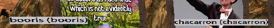

# WorldsPlayer Source Editor

This project enables anyone to fully decompile WorldsPlayer to Java source
files, edit them in any way, and recompile them back to a working WorldsPlayer
Java Archive.

# Usage

WorldsPlayer, and this project, require Java 6 to run. You can obtain a copy
of Java 6 for your platform from the [Oracle Java Archive](https://www.oracle.com/java/technologies/javase-java-archive-javase6-downloads.html).

This project additionally requires the
[Vineflower](https://vineflower.org/usage/) Java decompiler. Make sure that
`vineflower` is accessible from your `PATH` environment variable.

## Decompiling WorldsPlayer

To decompile WorldsPlayer, you will need to run the `decompile` Make task. This
task will decompile the full source tree of the WorldsPlayer Java Archive to the
[`source`](./source) directory.

You'll additionally need to provide the location of the WorldsPlayer Java
Archive as the `WORLDSPLAYER_JAR` environment variable.

```bash
WORLDSPLAYER_JAR=/path/to/worlds.jar make decompile
```

## Editing WorldsPlayer

You can edit the decompiled source files in any way you like.

## Recompiling WorldsPlayer

To recompile WorldsPlayer, you will need to run the `compile` Make task. This
task will recompile the full source tree of the WorldsPlayer Java Archive to the
[`out`](./out) directory.

You'll additionally need to provide the location of the Java 6 compiler as the
`JAVAC` environment variable.

```bash
JAVAC=/path/to/javac make compile
```

The recompiled WorldsPlayer Java Archive will be located at
[`out/worlds.jar`](./out/worlds.jar) and requires no additional configuration
to run in the WorldsPlayer client.

## Step-by-Step

```shell
# Decompile WorldsPlayer
WORLDSPLAYER_JAR=/path/to/worlds.jar make decompile

# Edit the source files in the source directory
find source -type f -name "*.java" -exec sed -i.bak 's/this\.setName(longID);/this.setName(longID + " (" + longID + ")");/' {} \;

# Recompile WorldsPlayer
JAVAC=/path/to/javac make compile

# Copy worlds.jar to your WorldsPlayer client
WORLDSPLAYER_JAR=/path/to/worlds.jar make install
```

Now that we've changed the username format from `username` to `username (username)`, we can run WorldsPlayer to verify that the change has been applied.



# Licence

This project is licensed with the [GNU General Public License v3.0](./LICENSE).